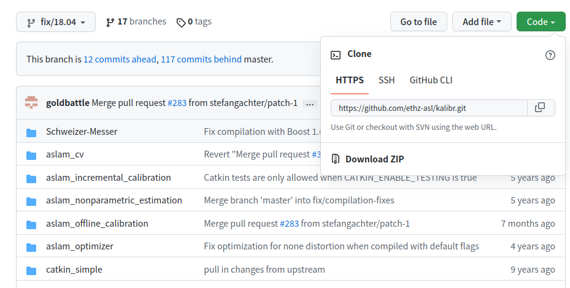
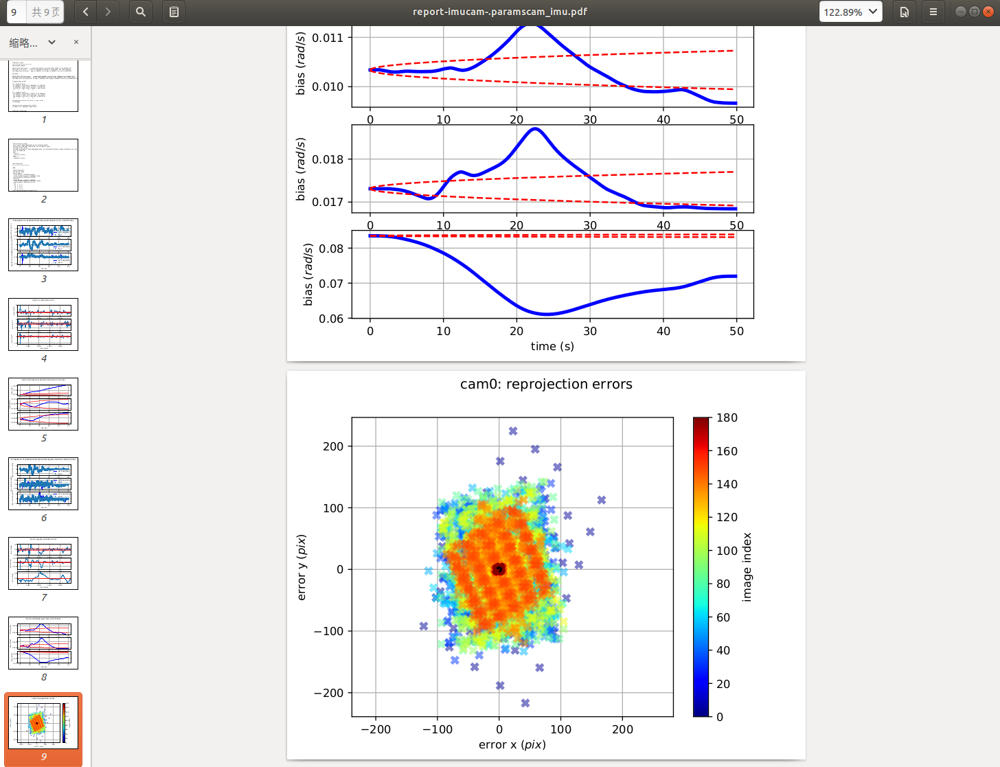

# camera-IMU-calibration

1. 标定板参数文件`target.yaml`

   ```yaml
   target_type: 'checkerboard'    # 标定板的类型，这里使用的棋盘格
   targetCols: 7                                   # 标定版列方向的角点数量
   targetRows: 5                                 # 标定办行方向的角点数量
   rowSpacingMeters: 0.03              # 每个棋盘格的宽，单位米
   colSpacingMeters: 0.03                # 每个棋盘格的高，单位米
   ```

   

2. IMU标定参数，包含IMU的噪声密度，随机游走 `imu.yaml`

   ```yaml
   rostopic: /imu0
   update_rate: 200.0  #Hz
   
   accelerometer_noise_density: 0.01  #continous
   accelerometer_random_walk: 0.0002
   gyroscope_noise_density: 0.005  #continous
   gyroscope_random_walk: 4.0e-06
   ```

   

3. 准备相机内参文件`camchain.yaml`； （[相机标定](./camera-calibration.md)）

   ```yaml
   cam0:
     camera_model: pinhole    # pinhole 针孔， omni 全向
     intrinsics: [461.629, 460.152, 362.680, 246.049] # 包含给定投影类型的内部参数的向量。要素如下：
                                                                                                     # pinhole：[fu fv pu pv]
                                                                                                     # omni：[xi fu fv pu pv]
                                                                                                     # ds：[xi alpha fu fv pu pv]
                                                                                                     # eucm：[alpha beta fu fv pu pv]
     distortion_model: radtan   # （radtan /equidistant）
     distortion_coeffs: [-0.27695497, 0.06712482, 0.00087538, 0.00011556]    # 失真模型的参数向量
     T_cam_imu:           # IMU extrinsics：从IMU到相机坐标的转换（T_c_i）
     - [0.01779318, 0.99967549,-0.01822936, 0.07008565]
     - [-0.9998017, 0.01795239, 0.00860714,-0.01771023]
     - [0.00893160, 0.01807260, 0.99979678, 0.00399246]
     - [0.0, 0.0, 0.0, 1.0]
     timeshift_cam_imu: -8.121e-05 #  相机和IMU时间戳之间的时间间隔，以秒为单位（t_imu = t_cam + shift）
     rostopic: /cam0/image_raw
     resolution: [752, 480]    # 相机分辨率[width,height]
   cam1:
     camera_model: omni
     intrinsics: [0.80065662, 833.006, 830.345, 373.850, 253.749]
     distortion_model: radtan
     distortion_coeffs: [-0.33518750, 0.13211436, 0.00055967, 0.00057686]
     T_cn_cnm1:       # 相机外在转换，总是相对于链中的最后一个相机（例如cam1：T_cn_cnm1 = T_c1_c0，将cam0转换为cam1坐标）
     - [ 0.99998854, 0.00216014, 0.00427195,-0.11003785]
     - [-0.00221074, 0.99992702, 0.01187697, 0.00045792]
     - [-0.00424598,-0.01188627, 0.99992034,-0.00064487]
     - [0.0, 0.0, 0.0, 1.0]
     T_cam_imu:
     - [ 0.01567142, 0.99978002,-0.01393948,-0.03997419]
     - [-0.99966203, 0.01595569, 0.02052137,-0.01735854]
     - [ 0.02073927, 0.01361317, 0.99969223, 0.00326019]
     - [0.0, 0.0, 0.0, 1.0]
     timeshift_cam_imu: -8.681e-05 
     rostopic: /cam1/image_raw
     resolution: [752, 480]
   
   ```

   For "plumb_bob", the 5 parameters are: (k1, k2, t1, t2, k3).

   **radtan**： [k1 k2 r1 r2]

   **equi**：[k1 k2 k3 k4]

   **fov**：[w]

4. 录制camera和IMU数据的包
   ```bash
   # 将camera和imu的topic进行修改:图像频率20hz,imu频率200hz
   rosrun topic_tools throttle messages /usb_cam/image_raw 20.0 /color
   rosrun topic_tools throttle messages /fdi_imu 200.0 /imu
   # 录制bag包
   rosbag record -O cam_imu.bag /color /imu
   ```


5. 安装[kalibr](https://github.com/ethz-asl/kalibr/tree/fix/18.04)，下载`fix/18.04`版本，否则在Ubuntu18.04系统上会出现`kalibr_calibrate_imu_camera：未找到命令`的错误。

  [ ](https://github.com/ethz-asl/kalibr/tree/fix/18.04)

   

   安装依赖项：

   ```bash
   sudo apt-get install python-setuptools python-rosinstall ipython libeigen3-dev libboost-all-dev doxygen libopencv-dev ros-melodic-vision-opencv ros-melodic-image-transport-plugins ros-melodic-cmake-modules python-software-properties software-properties-common libpoco-dev python-matplotlib python-scipy python-git python-pip ipython libtbb-dev libblas-dev liblapack-dev python-catkin-tools libv4l-dev
   
   sudo pip install python-igraph --upgrade
   
   # 如果无法通过 pip 安装 igraph，考虑如下方法：
   
   sudo add-apt-repository ppa:igraph/ppa
   sudo apt-get update
   sudo apt-get install python-igraph
   ```
   
   
   
   创建工作空间：
   
   ```bash
   mkdir -p ~/kalibr_workspace/src
   
   cd ~/kalibr_workspace
   
   source /opt/ros/melodic/setup.bash
   
   catkin init
   
   catkin config --extend /opt/ros/melodic
   
   catkin config --cmake-args -DCMAKE_BUILD_TYPE=Release
   ```
   
   下载编译Kalibr
   
   ```bash
   cd ~/kalibr_workspace/src
   
   // 将压缩包解压到 `src`文件夹下
   
   cd ~/kalibr_workspace
   
   catkin build -DCMAKE_BUILD_TYPE=Release -j4
   ```
   


6. 开始标定

   ```bash
   cd ~/kalibr_workspace
   
   source devel/setup.bash
   
   kalibr_calibrate_imu_camera --target april_6x6.yaml --cam camchain.yaml --imu imu_adis16448.yaml --bag dynamic.bag --bag-from-to 5 45
   ```

   **结果**
   
   
   
   

